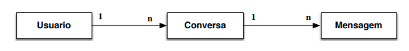

1. O	diagrama	acima	representa	as	classes	de	um aplicativo	de	conversas	por	
mensagens	e	as	suas	associações. Implemente	as	classes	do	diagrama	tal	que	
possuam	atributos	da	seguinte	forma:

    1. Classe	Usuário:	contém o	atributo	privado	nome do	tipo	String
    correspondente	ao	nome	do	próprio	usuário e	um	atributo	que	
    representa	a	sua	coleção	de	conversas.
    
    2. Classe	Conversa:	contém	o	atributo	privado	nome	do	tipo	String
    correspondente	ao	nome	do contato	(outro	usuário) e	um	atributo que	
    representa	a	coleção	de	mensagens da	conversa.
    
    3. Classe	Mensagem:	contém	o	atributo	privado	texto	do	tipo	String e	um	
    atributo	do	tipo	boolean para	indicar	se	é	uma	mensagem	“enviada”
    (true)	ou “recebida” (false).
    
2. A	classe	Usuário deve	possuir	os	seguintes	métodos	públicos	(além	do	construtor):
    1. Iniciar	uma	conversa	com	um	contato.	Parâmetro:	nome	do	contato. Isso	
    implica	em	criar	duas	instâncias	da	classe	Conversa,	uma	para	cada
    usuário.
    
    2. Enviar	uma	mensagem.	Parâmetros:	nome	do	destinatário e	a	mensagem
    do	tipo	String. Isso	implica	em	inserir	a	mensagem	como	“enviada” na	
    correspondente	conversa. Assim,	deve	haver	um	método	próprio	para	
    isso	na	classe	Conversa.
    
    3. Receber	uma	mensagem.	Parâmetros:	nome	do	remetente e	a	mensagem.
    Deve-se	garantir	que	toda	mensagem	enviada	por	um	usuário	seja	
    recebida por	outro	usuário,	isto	é,	uma	mensagem	que	consta	como	
    “enviada” numa	conversa	de	um	usuário	deve	constar	também	na	
    correspondente	conversa	do	usuário	destinatário	da	mensagem,	porém	
    como	“recebida”.
    
    4. Imprimir	todas	as	mensagens	de	uma	conversa.	Parâmetro:	nome	do	
    contato. Este	método	deve	chamar um	método	imprimir da	instância	de	
    Conversa,	o	qual	chama	o	método	imprimir das	instâncias	de	
    Mensagem,	respeitando-se,	assim, o	princípio	de	encapsulamento.
    Finalmente,	deve	haver uma	classe	Inicio contendo	o	método	main que	
    implementa	uma	interface	interativa	com as	seguintes	opções:
    
        1. Criar	um	novo	usuário (e	inseri-lo	numa	coleção	de	usuários
        
        2. Mostrar	todos	os	usuários	criados
        
        3. Iniciar	uma conversa	entre	dois	usuários
        
        4. Mostrar	a	lista	de	usuários	com	os	quais	um	usuário	mantém	conversas
        
        5. Enviar	uma	mensagem	de	um	usuário	para	outro Usuario Conversa Mensagem
        
        6. Mostrar todas	as	mensagens	de	uma	conversa	de	um	usuário
        
        7. Encerrar	o	programa
        
        
3. Sugestão	para	implementação	da	interface	interativa:	classe	java.util.Scanner