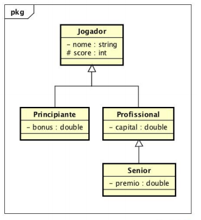

Considere	a	hierarquia	de	classes	representado	no	diagrama	acima.	Os	atributos	
são	anotados	com	um	símbolo	"- "	para	indicar	visibilidade	private e	com	um	
símbolo	"#"	para	indicar	visibilidade	protected.	Implemente	as	classes	com	os	
atributos	indicados	no	diagrama acima e	com	métodos	da	seguinte	forma:

1. Classe	Jogador
    1. Método	construtor
    2. void	imprimir(	) :	imprime todos	os	atributos	do	objeto
    
2. Classe	Principiante
    1. Método	construtor
    2. void	imprimir(	) :	imprime	todos	os	atributos	do	objeto
    3. void	ganhar(int	p) :
        1. adiciona	p	ao	score;	
        2. adiciona	10%	de	p	ao	bonus.
    4. void	perder(int	p) :
        1. subtrai	p	do	score
        2. desconta	10%	de	p	do	bonus.
        
3. Classe	Profissional
    1. Método	construtor
    2. void	imprimir(	) :	imprime	todos	os	atributos	do	objeto
    3. void	ganhar(int	p ) :
        1. adiciona	p	ao	score;
        2. aumenta	o	capital	de	p	*	4
    4. void	perder(int	p) :
        1. subtrai	p	do	score
        2. diminui	o	capital	de	p	*	4
        
4. Classe	Senior
    1. Método	construtor
    2. void	imprimir(	) :	imprime	todos	os	atributos	do	objeto
    3. void	ganhar(int	p ) :	
        1. chama	o	método	ganhar	da	superclasse
        2. dobra	o	valor	do	prêmio
    4. void	perder(int	p ) :	
        1. chama	o	método	perder	da	superclasse
        2. reduz	o	valor	do	prêmio	à	metade
        
    Deve	ser	implementada	uma	classe	adicional	denominada	Teste contendo	o	
método	main que	deverá	criar	um	objeto	de	cada	tipo	de	jogador	(Princiante,	
Profissional	e	Senior)	e	chamar	todos	os	métodos	disponíveis	para	esses	objetos